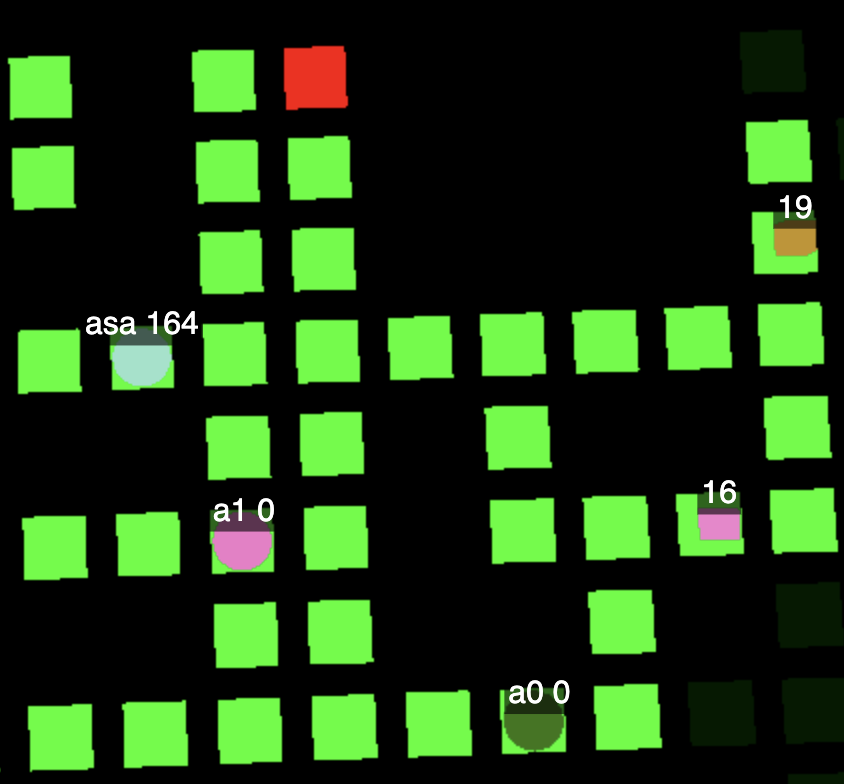

# Deliveroo {#sec:deliveroo}
*Deliveroo* is the playground environement which has been provided to develop our BDI agents. It consists of a delivery-based game, where agents move on a bidimensional grid. The objective of the game is to pick up parcels that are scattered across the map and deliver them as fast as possible in the tile classified as delivery zones. Each parcel has an assigned reward value, which can decay over time, that is assigned to the agent that delivers it.

{ width=250px #fig:grid-map}

The game can be played by either a single agent or multiple agents too. In the latter case, agents are solid entities and can block the road to each other.

Agents usually don't have the full perception of the world, but can perceive only other agents and parcels within a limited distance radius. Agents can also carry and deliver multiples parcels at the same time.

Deliveroo has been designed to offer many different game scenarios, thanks to the usage of many parameters:
- *parcel*: generation interval, reward decay, reward value distribution;
- *player*: steps number and movement speed;
- *external agent*: quantity and movement speeed;
- *sensing*: parcel and agent sensing radius;
- *map*: definition of the grid board and tile classification (walkable, non-walkable, delivery)
- *game clock*.

Specifically, this exam project is split in two delivebles, each one with a different solution strategy:
- *single-agent*: the agent acts alone trying to maximize its score;
- *multi-agent*: the agent communicates with others to share information and to maximize the overal score of the group.
