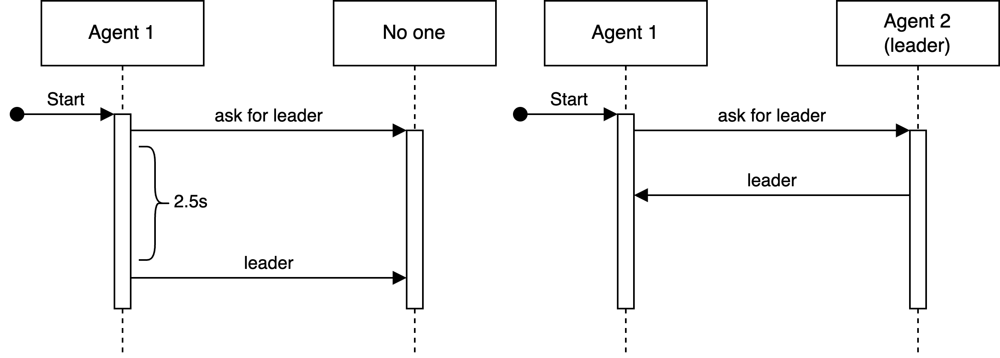

# Problem Analysis {#sec:problem-analysis}
Given the complexity of the environment several solutions have been implemented to overcome different difficulties and challenges.

## Manhattan distance {#sec:manhattan-distance}
The *Manhattan distance* is function that can provide a quick estimation of the distance between two points.

$$
d_{ab} = | b_x - a_x | + | b_y - a_y |
$$

In the deliveroo environment it is insufficient since many tiles can be non walkable, but at the same time it's fast heruistic to compute.

## Problem parameters estimation {#sec:problem-parameters-estimation}

As explained in Section {@sec:deliveroo}, multiple parameters can be modified during the game initialization. Some of them are given to the agent, others are obscure and can be only estimated. We mainly focused on the estimation of player speed and parcel decay for a more accurate computation of the potential reward associated to a given parcel.

### Player speed {#sec:player-speed}
Each time the agent moves the new position is communicated by the environment to the agent, we have decided to keep track of the timestamp in which the information is perceived. The list of timestamps can then be used to estimate the player velocity using the following algorithm:

\begin{algorithm}[H]
\caption{Player speed estimation}
\begin{algorithmic}[1]
\Procedure{updateMainPlayerSpeedEstimation}{$\mathcal{D}, s, \phi$}
\State $\text{deltas} \gets []$ \Comment{Initialize an empty array of deltas}
\ForAll {$\text{timestamp}\ t_i \in \mathcal D$}
\State $deltas.append(t_i - t_{i-1})$ \Comment{Delta of two consecutive timestamps}
\EndFor

\State $c \gets s * (1 - \phi)$ \Comment{Current speed contribution}
\State $n \gets \text{avg}(deltas) * \phi$ \Comment{New speed contribution}
\State $s \gets c + n$ \Comment{New estimation}
\State \Return $c$
\EndProcedure
\end{algorithmic}
\end{algorithm}

The hyper-parameter $\phi$ is the learning rate that can be used to regulate the impact of the contribution with respect to the current speed estimation.

### Parcel decay {#sec:parcel-decay}
Another important parameter for the correct definition of an agent is the parcel decay, it is the number velelocity of the reward decrease. Similarly to the player speed estimation, the parcel decay estimation is computed from timestamp differences, where a timestamp is associated to an update of a visible parcel.

\begin{algorithm}[H]
\caption{Get parcel decay estimation}
\begin{algorithmic}[1]
\Procedure{getParcelDecayEstimation}{$\mathcal{D}$}
\State $\text{deltas} \gets []$ \Comment{Initialize an empty array of deltas}
\ForAll {$\text{timestamp}\ t_i \in \mathcal D$}
\State $deltas.append(t_i - t_{i-1})$ \Comment{Delta of two consecutive timestamps}
\EndFor
\State \Return deltas
\EndProcedure
\end{algorithmic}
\end{algorithm}

\begin{algorithm}[H]
\caption{Parcels decay estimation}
\begin{algorithmic}[1]
\Procedure{updateParcelsDecayEstimation}{$\mathcal{P}, d, \phi_2$}
\State $\text{deltas} \gets []$ \Comment{Initialize an empty array of deltas}
\ForAll {$\text{parcel}\ p_i \in \mathcal P$}
\State $deltas.concat(getParcelDecayEstimation(p.timestamps))$ \Comment{}
\EndFor

\State $c \gets d * (1 - \phi_2)$ \Comment{Current decay contribution}
\State $n \gets \text{avg}(deltas) * \phi_2$ \Comment{New decay contribution}
\State $d \gets c + n$ \Comment{New estimation}
\State \Return $d$
\EndProcedure
\end{algorithmic}
\end{algorithm}

The learning rate $\phi_2$ can be used to regulate the impact of the contribution with respect to the current parcel decay estimation.

## Probabilisitic model {#sec:probabilistic-model}
In the environment there may be multiples competitive agents, their ability of picking up parcels highly infuences the value of a parcel. For this reason we have devised a penalty value based on a probabilistic model capable of takimg into consideration the possible opponents' plans.

The main idea behind the probabilistic model is the following assertion: if there is a parcel and I am the closest agent I can reach it faster than any other agents, consequentially that parcel should be taken more into consideration, even if its value is lower than other further parcels.

This assertion can be modeled as follow

$$
\text{penalty probability} = \frac{\sum_{a \in \mathcal{A}} \frac{d_{max} - d_{pa}}{d_{max}}}{|A|}
$$

with $\mathcal{A}$ the set of opponent agents, $d_{max}$ the maximum distance betweent the parcel and the union between oppoents agents, main player, and cooperative agents, $d_{pa}$ the distance parcel oppenent agent.

## Potential parcel score {#sec:potential-parcel-score}
The decision process behind the choice of a parcel is one of the key elements for the definition of a good agent. Many elements and metrics have been taken into consideration to better estimate the potential gain of a parcel. The final reward is computed as:

$$
r_f = r - \left (d_{ap} * \frac{s_a}{decay}\right ) - \left (d_{min} * \frac{s_a}{decay}\right ) - r * \text{penalty probability}
$$

where $d_{ap}$ is the distance between the agent and the parcel, $s_a$ is the estimatated speed, $d_{min}$ is the minimum distance between the parcel and any delivery zone, and $\text{penalty probability}$ is the probability computed on Section {@sec:probabilistic-model}.

The resulting formula takes into reward the lost of approaching the parcel and delivery it to the closest delivery zone, moreover the probabilistic model can provide a rough estimation of other agents' intentions.

## Distances cache {#sec:distance-cache}
A distance cache was maintained to save some computational power, every time a plan is computed the distance between the starting point and any other tile in the path is saved in the cache.

The cache is then used in many parts of the code.

## Replan {#sec:replan}
Qui non so se per ora il replan dopo 5 tentativi sia interessante da menzionare.
## Communication protocol {#sec:communication-protocol}
The communication protocol is based on the provided library that offers multiple endpoints to handle different messages: `say`, `shout`, `ask`, and NON RICORDO L'ULTIMO.

### Leader negotiation
The leader negotiation is a fundamental step in the multi-agent architecture where one agent is chosen to be the leader who computes all the plans for the other agents. The election of the leader is a well known problem in the computer science literature, nevertheless we have decided to keep a simple solution since the focus on the project was something else. The negotation is achieved thanks to two message types: `askforaleader` and `leader`, the former is sent by every agent when they receive for the first time their position, as the name says the message simply asks for a leader. The latter is used to communicate the leader and it is used only by the agent who is the leader.
After the `askforleader` message is sent a timeout of $2.5s$ is set, if no answer by an actual leader is received in the specficied amount of time it means that the game has no leader and consequentially the agent who asked for the leader will be elected and it will also communicate the election to all other agents listening.

{ width=250px #fig:leader-negotation}

### Information sharing
Different information are shared during the game across the agents in the same team. For simplicity we have decided to use a broadcast communication, in this way we do not have to keeep track of all the ids and
