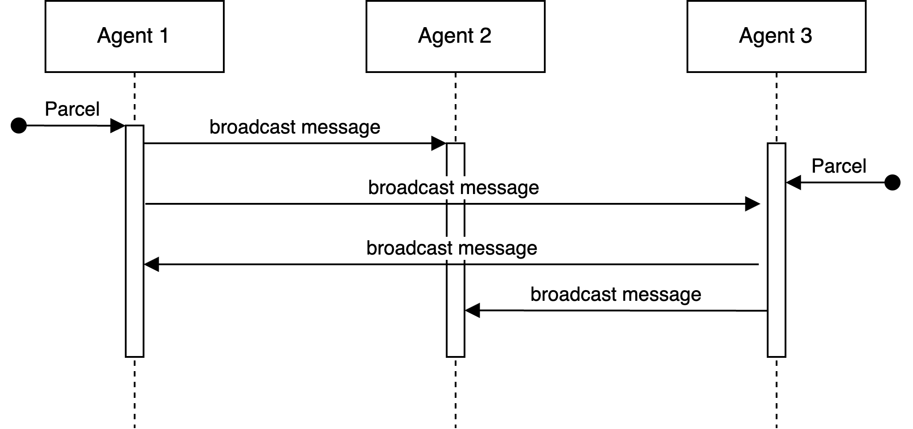
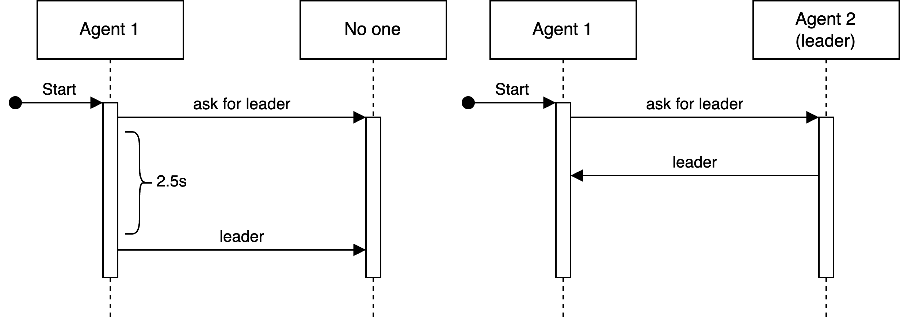
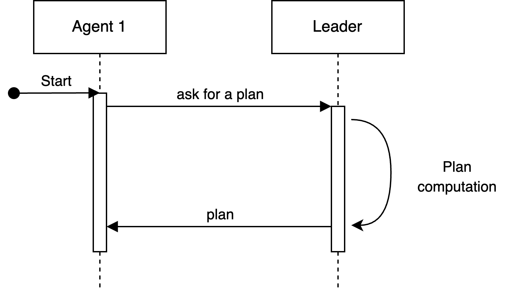
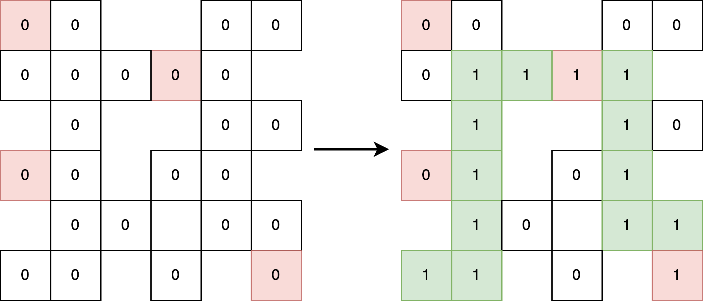
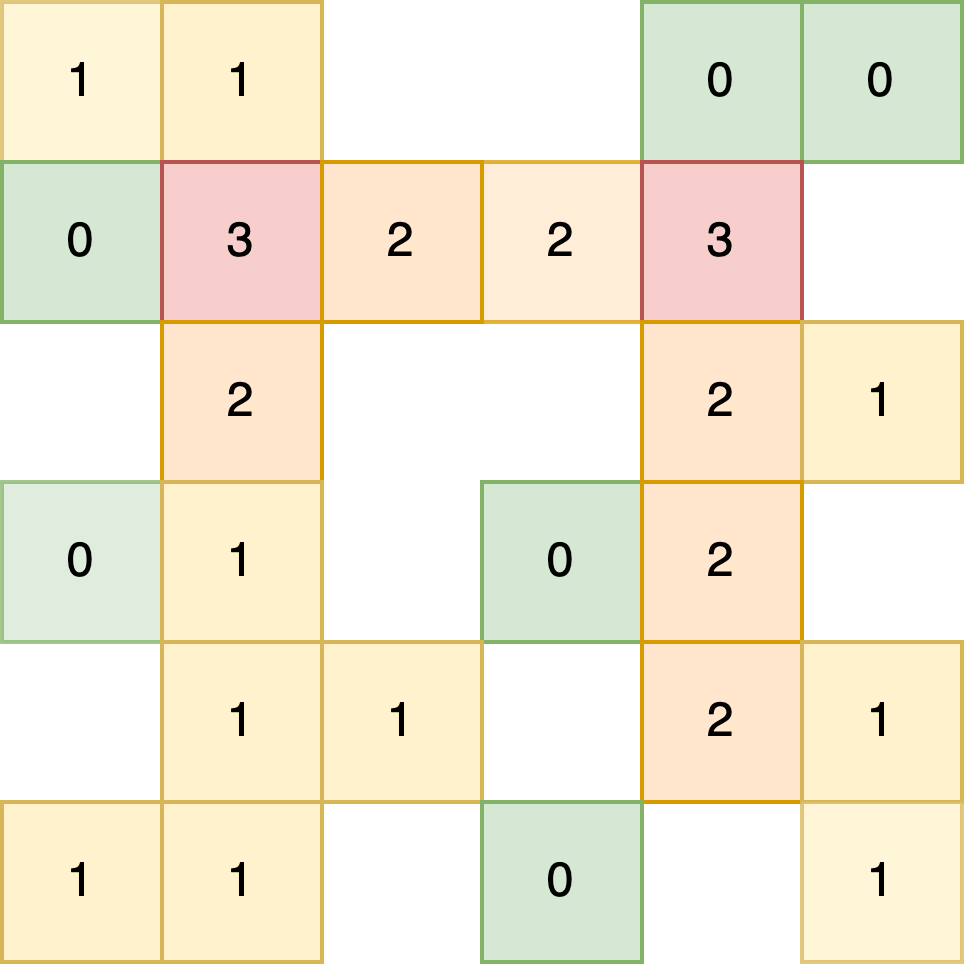

# Multi agent implementation {#sec:multi-agent}
The communication protocol utilized in our implementation is built upon a library that provides various endpoints to facilitate the handling of different types of messages. These endpoints include "say" for regular communication, "shout" for broadcasting messages to all agents, "ask" for querying other agents, and "broadcast" for widespread information dissemination. By leveraging these endpoints, agents are able to engage in effective communication and exchange relevant information during the game.

## Information sharing agents {#sec:information-sharing-agents}
During the game, teams have the ability to share sensed data from the environment among their members. For simplicity, our agents utilize broadcast messages as the means of sharing information, making them visible to all connected agents in the game.

This allows each agent to construct its own plan based on the information sensed by all other agents across the map. Additionally, agents communicate their intended parcel pickups and the corresponding plans via broadcast messages. This mechanism helps reduce collisions among agents on the map and prevents unnecessary detours to pick up parcels that have already been claimed.

{ width=250px #fig:information-sharing}
 
By sharing information, agents are able to compute more refined plans that take into account hidden map locations. This multi-agent implementation follows a distributed model that can scale effectively with a large number of agents. Moreover, since there is no central computing unit, agents can be added or removed at any time.

It is important to note that this approach relies on broadcast communication, which means that any malicious agent could potentially understand the communication protocol and inject false information. To address this issue, we have considered implementing an encryption mechanism based on an initial exchange of keys. However, considering the nature of the course, we opted for a simpler implementation, focusing on other important implementation details.

## Leader-members agents
The leader negotiation process plays a pivotal role in the multi-agent architecture, whereby one agent is designated as the leader responsible for computing plans for all other agents.

### Leader negotiation
The process of electing a leader is a well-known problem in computer science, but for the purpose of our project, we opted for a simple solution due to our focus on other aspects. The negotiation for the leader role is facilitated through two types of messages: "askforaleader" and "leader".

Upon connecting to the game and receiving their initial position, each agent broadcasts an "askforaleader" message, inquiring if a leader has already been elected. This message serves as a request for information regarding the existence of a leader. Conversely, the "leader" message is used by the agent who has been elected as the leader to communicate its identity.

Following the transmission of the "askforaleader" message, a timeout period of 2.5 seconds is set. If no response from an existing leader is received within this timeframe, it indicates that no leader has been elected yet. In such a case, the agent who sent the "askforaleader" message assumes the role of the leader and broadcasts a message to inform other agents of its newly elected leader status.

{ width=250px #fig:leader-negotation}

It is important to note that the simple implementation described above may introduce rare scenarios where multiple agents connect at exactly the same time, potentially leading to a race condition and the presence of multiple active leaders.

This enhanced model implementation can be considered an extension of the approach discussed in Section {@sec:information-sharing-agents}. In addition to sharing information about non-visible areas, this model allows for more comprehensive decision-making by leveraging knowledge derived from the computation of all plans. However, it comes with certain drawbacks. Firstly, it introduces a single point of failure, as all plans are generated by a single node. Secondly, the scalability of the system is limited when dealing with a large number of nodes. On the positive side, the system offers enhanced security, as plan communication occurs through point-to-point communication channels that cannot be accessed by malicious agents.

### Plan communication
The plan communication system operates in a straightforward manner. When an agent does not have a plan, it initiates a request for a new plan by sending an askforplan message. This request is implemented using a point-to-point ask primitive, which ensures that the request is directed specifically to the leader. Upon receiving the request, the leader begins the process of computing the plan. Once the computation is complete, the leader sends the list of actions comprising the plan back to the original agent using another point-to-point communication. This ensures that the plan is securely and efficiently transmitted between the leader and the requesting agent.

{ width=250px #fig:leader-negotation}

### Traffic penalty
In this communication model, the leader serves as the central compute node responsible for generating plans for all agents. This central position grants the leader extensive knowledge about the future movements of other agents. To enhance the computation of potential parcel scores described in Section {@sec:potential-parcel-score}, we have introduced an additional penalty that accounts for traffic considerations and aims to create plans that evenly distribute agents across the entire map.

To facilitate this, a traffic map is maintained on the leader. This map is a copy of the original map, and it is updated every time a plan is generated. For each tile included in a plan, the corresponding position on the traffic map is incremented by 1. When an agent requests a new plan, the previously computed plan for that agent is used to decrement the corresponding positions on the traffic map. This approach allows for the consideration of traffic patterns and encourages agents to choose paths that minimize congestion and evenly distribute their movements throughout the map.

{width=250px #fig:traffic-map}

In Figure {@fig:traffic-map} it is presented an empty traffic map (on the left) with the respective delivery zones, after the computation of a plan the traffic map is updated (on the right). This process is applied for every generated plan and the final result is presented in Figure {@fig:traffic-map-final}, it is clear that some tiles are more trafficate than others.

{width=250px #fig:traffic-map-final}

With the traffic map it is possible to take a parcel and analyze its neighbours in order to understand if it is a trafficated area and consequentially if it is a good idea to take it.

The logic behind the traffic penalty is summarized in the following pseudocode:

\begin{algorithm}[H]
\caption{Traffic penalty}
\begin{algorithmic}[1]
\Procedure{trafficPenalty}{$M$, $p$}
\State $m \gets \text{max}(M)$ \Comment{Obtain the maximum traffic in the current traffic map}
\State $t \gets 0$ \Comment{Initialize neighbourhood traffic}
\State $ns \gets \text{getNeighbours}(p)$ \Comment{Get parcel neighbour tiles}
\ForAll {$\text{neighbour}\ n_i \in ns$}
\State $traffic \gets traffic + M[p.x][p.y]$ \Comment{Update neighbourhood traffic}
\EndFor
\State $t \gets t / \text{len}(ns)$ \Comment{Average neighbourhood traffic}
\State $p \gets \text{min}(t / m)$ \Comment{Obtain a probability from average traffic}
\State \Return $2 * p.reward * p$
\EndProcedure
\end{algorithmic}
\end{algorithm}

## Implementation comparisons

| **Distributed based**            | **Leader based**               |
|----------------------------------|--------------------------------|
| Malicious information injection  | Single point of failure        |
| Scalable on the number of agents | Single compute node            |
| Resilient                        | Ability to compute traffic map |
